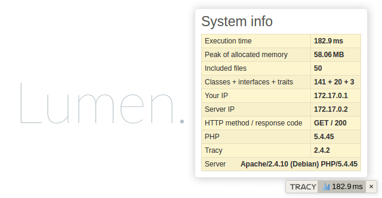

# [Tracy] Wrapper

Helper which helps you with [Tracy] injection into your project.




## Usage

```php
<?php // index.php

$panels = [new BarPanelA(), new BarPanelB()];
// or
$panels = function () { // will be called only if Tracy detects development mode
    return [new BarPanelA(), new BarPanelB()];
};

tracy_wrap(function() {
    app()->run();
}, $panels /* optional */);
```


## How to install

Run `composer require netpromotion/tracy-wrapper` in your project directory.


[Tracy]:https://tracy.nette.org/
